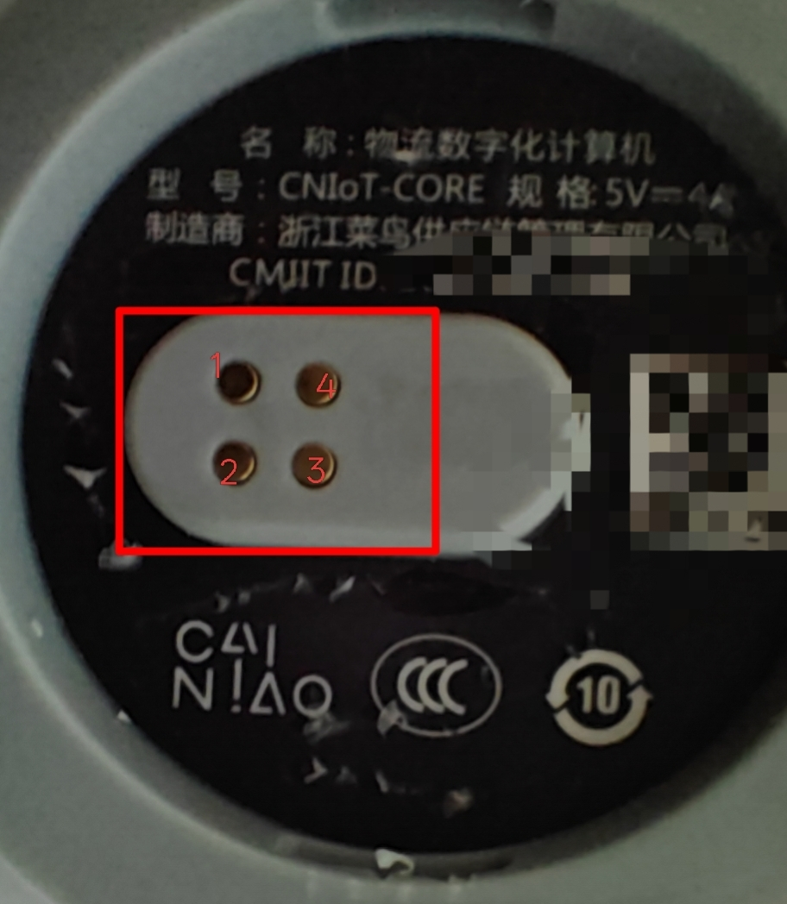
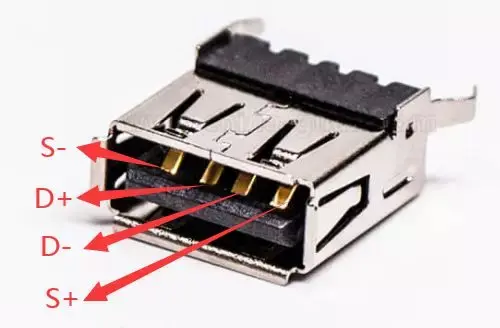
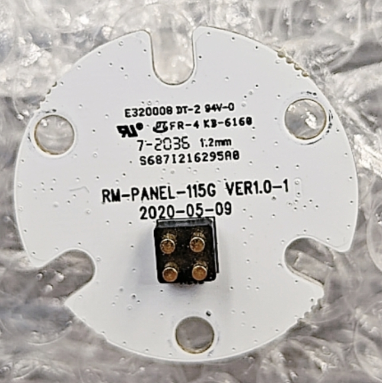
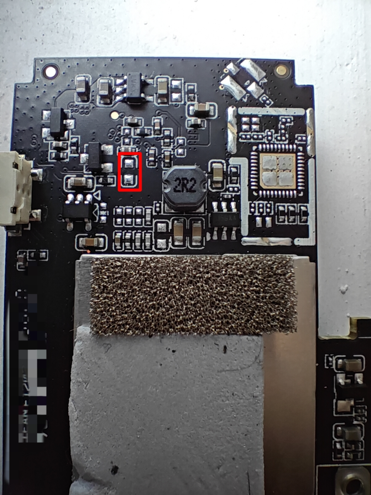

# 固件

[Armbian](https://github.com/armbian/community)

[Batocera](https://github.com/retro98boy/batocera.linux)

# 硬件

菜鸟物流终端A311D版，可拆成主机和底座两个部分


## 主机

Amlogic A311D SoC，2 GB DDR，16 GB eMMC

无SD卡槽，所以A311D只能从eMMC加载FIP

千兆网口和RTL8822CS WiFi/BT

一个USB Type-C用于在USB下载模式下供电和传输数据

侧边存在金属触点形式的USB接口，和Type-C共用主机的USB 2.0总线，通过SGM7227切换，拉低GPIOA_14即可切换到侧边的USB触点，此时Type-C中的数据通道失效。如果要焊接，推荐先将触点的表面刮成粗糙状便于上锡

侧边还存在6 x WS2812 LED，通过GPIOH_4驱动，驱动见**呼吸灯**章节






| 内部连接器 | 侧边金属触点 |            |
|----------|------------|------------|
| 1        |            | GPIOH_4    |
| 2        | 1          | GND        |
| 3        | 4          | USB 2.0 D- |
| 4        | 3          | USB 2.0 D+ |
| 5        | 2          | USB 5V     |
| 6        |            | LED 5V     |

侧边面板内部构造：




## 底座

底座有不同型号，但软件应该通用

带USB HUB，显示（HDMI或VGA），供电（USB Type-C或DC）

## 调试点位

调试串口，焊接推荐专用细飞线


eMMC短接点



# 主线U-Boot

在[armbian/build](https://github.com/armbian/build)仓库搜索cainiao-cniot-core即可找到添加该设备支持的U-Boot补丁

打上补丁后，使用`make cainiao-cniot-core_defconfig && make CROSS_COMPILE=aarch64-linux-gnu- -j$(nproc)`编译得到u-boot.bin

## 制作带主线U-Boot的FIP

使用解包软件（见下文）从设备的USB刷写包中获得厂家的FIP：

```
# burn-img-extract下的DDR.USB即为厂家的FIP
aml_image_v2_packer -d CAINIAO_A311D_RTL8211F_FLINK6222B_2G_原机全分区线刷救砖包仅加当贝桌面.img burn-img-extract
```

也可以尝试在开机的设备上直接使用dd命令提取eMMC上的FIP

一般user area和boot area的FIP相同，二选一即可：

```
# boot area
# 如果是Android，需要改为/dev/block/mmcblk1boot0
dd if=/dev/mmcblk1boot0 of=somewhere/vendor-fip bs=512 skip=1

# user area
# 如果是Android，需要改为/dev/block/mmcblk1
dd if=/dev/mmcblk1 of=somewhere/vendor-fip bs=512 skip=1 count=8192
```

然后使用[gxlimg](https://github.com/repk/gxlimg)解包FIP：

```
gxlimg -e vendor-fip fip
```

最后替换厂家的U-Boot为主线U-Boot并重新打包成FIP：

```
rm fip/bl33.enc
# 这一步可能存在Bug，见下文的替换步骤
gxlimg -t bl3x -s path-to-u-boot.bin fip/bl33.enc
gxlimg \
-t fip \
--bl2 fip/bl2.sign \
--ddrfw fip/ddr4_1d.fw \
--ddrfw fip/ddr4_2d.fw \
--ddrfw fip/ddr3_1d.fw \
--ddrfw fip/piei.fw \
--ddrfw fip/lpddr4_1d.fw \
--ddrfw fip/lpddr4_2d.fw \
--ddrfw fip/diag_lpddr4.fw \
--ddrfw fip/aml_ddr.fw \
--ddrfw fip/lpddr3_1d.fw \
--bl30 fip/bl30.enc \
--bl31 fip/bl31.enc \
--bl33 fip/bl33.enc \
--rev v3 fip-with-mainline-uboot.bin
```

> [当前版本](https://github.com/repk/gxlimg/tree/0d0e5ba9cf396d1338067e8dc37a8bcd2e6874f1)的gxlimg有Bug，一些u-boot.bin在被处理后，打包出来的FIP不可用，随便调整下U-Boot的config，让编译出的u-boot.bin变化一下，就可能触发不了这个Bug
>
> 可使用[aml_encrypt_g12b](https://github.com/LibreELEC/amlogic-boot-fip/tree/master/khadas-vim3)来替代gxlimg处理u-boot.bin：aml_encrypt_g12b --bl3sig --input u-boot.bin --output fip/bl33.enc --level v3 --type bl33
>
> 似乎和这个[issues](https://github.com/repk/gxlimg/issues/19)相同
>
> 一些和gxlimg类似的仓库：[angerman/meson64-tools](https://github.com/angerman/meson64-tools) [afaerber/meson-tools](https://github.com/afaerber/meson-tools)

# 主线内核

在[armbian/build](https://github.com/armbian/build)仓库搜索cainiao-cniot-core即可找到该设备的主线内核dts

## 外设工作情况

| Component             | Status                     |
|-----------------------|----------------------------|
| GBE                   | Working                    |
| WiFi                  | Working                    |
| BT                    | Working                    |
| PWM Fan               | Working                    |
| eMMC                  | Working                    |
| USB                   | Working                    |
| HDMI Display          | Working                    |
| HDMI Audio            | Working                    |
| Internal Speaker      | Working                    |
| Power Button          | Working                    |
| ADC Key               | Working                    |
| Breathing Light       | Working                    |
| USB 2.0 Side Contacts | Working                    |

## 音频

测试命令：

```
# playback via HDMI
aplay -D plughw:CNIoTCORE,0 /usr/share/sounds/alsa/Front_Center.wav

# playback via internal speaker
aplay -D plughw:CNIoTCORE,1 /usr/share/sounds/alsa/Front_Center.wav
```

## 呼吸灯

主线内核将GPIOH_4复用成SPI MOSI，然后在user space通过操作spidev来控制呼吸灯，简单的demo在本仓库的breathing-light目录下，使用方法：

```
gcc -o ws2812 ws2812.c -lm && ./ws2812
```

可以在PC上交叉编译：

```
aarch64-linux-gnu-gcc --static -o ws2812-static-arm64 ws2812.c -lm
```

## NPU

在主线内核中使能`CONFIG_DRM_ETNAVIV`即可支持驱动NPU，在用户空间的软件堆栈为Mesa OpenCL

参考[phoronix](https://www.phoronix.com/news/Etnaviv-NPU-Weight-Compress)

# 安装系统

Amlogic USB Burning Tool使用专有的固件格式，虽然固件扩展名为.img，但它并不是disk image文件

存在一些可以对其解包/打包的软件：

[Amlogic binary only executable](https://github.com/khadas/utils/blob/master/aml_image_v2_packer)

[hzyitc/AmlImg](https://github.com/hzyitc/AmlImg)

[7Ji/ampack](https://github.com/7Ji/ampack)

将该设备的所有img系统镜像都重打包成USB刷写包并不划算

可以将带主线U-Boot的FIP打包成USB刷写包，用于将设备恢复到有主线U-Boot的状态，主线U-Boot中带有以太网，USB，eMMC的驱动，这足够做很多的事了

## 写入主线U-Boot

### 通过dd命令

如果设备上存在工作的系统例如Android或者Linux，且具有root用户权限，只需要将fip-with-mainline-uboot.bin写入eMMC即可：

```
dd if=path-to-fip-with-mainline-uboot.bin of=/dev/mmcblk1 bs=512 seek=1
```

同时推荐将FIP刻录到eMMC的boot area，因为A311D在eMMC用户区找不到FIP后，会尝试从eMMC的boot area查找FIP

在Linux上，可以：

```
# 检查是否有权限写入boot area
blockdev --getro /dev/mmcblk1boot0
blockdev --getro /dev/mmcblk1boot1

# 解锁boot area的写入权限
echo 0 | sudo tee /sys/block/mmcblk1boot0/force_ro
echo 0 | sudo tee /sys/block/mmcblk1boot1/force_ro

dd if=path-to-fip-with-mainline-uboot.bin of=/dev/mmcblk1boot0 bs=512 seek=1
dd if=path-to-fip-with-mainline-uboot.bin of=/dev/mmcblk1boot1 bs=512 seek=1
```

### 通过USB下载模式

如果无法获得设备上已有系统的root用户权限，可以使用Amlogic USB Burning Tool搭配制作的USB刷写包fip-with-mainline-uboot.burn.img来直接将主线U-Boot刻录到eMMC。USB下载流程见**USB下载模式刻录eMMC**

> Amlogic USB Burning Tool会将FIP同时写入到eMMC的user area和boot area

## 写入系统镜像

### 写入系统镜像到U盘

如果经常尝试各种不同的系统，考虑到eMMC的寿命以及便捷性，你可能会选择从U盘启动系统。只需要将.img文件刻录到U盘，插入设备并开机即可，因为eMMC上的主线U-Boot会自动按照顺序扫描eMMC，USB，网口等外设并找到合适的启动环境，例如U-Boot script，extlinux，TFTP

> 如果A311D还是从eMMC启动，说明eMMC上有可启动的系统。要让A311D从U盘驱动，需要摧毁eMMC上的系统，例如删除eMMC上的MBR分区表。或者在U-Boot命令行界面输入`setenv boot_targets usb0 && boot`，如果你引出了UART线缆

### 写入系统镜像到eMMC

#### 方法一

该方法需要U盘和此设备接入网络

先将Armbian系统镜像写入U盘，使用U盘启动此设备。再将要安装的系统镜像通过网络传输到U盘中，最后使用dd命令将系统刻录到eMMC：

```
dd if=path-to-your-os-img of=/dev/mmcblk1 status=progress
```

或者使用一个小技巧来避免将系统镜像传输到U盘

在U盘启动的Armbian上安装Netcat，然后执行：

```
nc -l -p 1234 > /dev/mmcblk1
```

在Linux PC上安装Netcat，然后执行：

```
nc -w 3 your-cainiao-cniot-core-ip 1234 < path-to-your-os-img
```

> Netcat有GNU和OpenBSD两个变种，如果在PC端安装的是GNU Netcat，则命令应该为：
> ```
> nc -w 3 -c your-cainiao-cniot-core-ip 1234 < path-to-your-os-img
> ```
>
>  安装OpenBSD Netcat的命令：
> ```
> # ArchLinux
> sudo pacman -S openbsd-netcat
> # Ubuntu/Debian
> apt install netcat-openbsd
> ```
>
>  安装GNU Netcat的命令：
> ```
> # ArchLinux
> sudo pacman -S gnu-netcat
> # Ubuntu/Debian
> sudo apt install netcat-traditional
> ```

#### 方法二

该方法需要用户将设备UART连接至PC，且此设备通过以太网络和PC接入同一个LAN

先将要安装的系统镜像放到Linux PC上并重命名，这里假设为batocera.img

然后在Linux PC上将其分割，因为此设备的内存不足以一次性保存整个img：

```
split -b 512M batocera.img batocera.img.
# 假设batocera.img被分割成了batocera.img.aa batocera.img.ab batocera.img.ac，记住它
```

在PC上准备一个TFTP服务器

Windows用户一般使用[Tftpd64](https://pjo2.github.io/tftpd64/)

在Linux上也有类似的软件[puhitaku/tftp-now](https://github.com/puhitaku/tftp-now)，在Releases下载二进制安装到PATH，然后执行`sudo tftp-now serve -root dir-to-batocera.img.aX`即可

在设备上电的时候，通过在UART会话中敲击空格键进入U-Boot命令行界面

设置此设备的网络：

```
setenv ipaddr 172.24.0.241
setenv netmask 255.255.252.0
setenv gatewayip 172.24.0.1
setenv serverip 172.24.0.248
```

上面的172.24.0.248是PC的IP

设置临时存储img的RAM地址：

```
setenv loadaddr 0x20000000
```

开始从PC TFTP服务器下载img并写入到eMMC：

```
setenv mmcscript 'setenv files "batocera.img.aa batocera.img.ab batocera.img.ac"; setenv offset 0x0; for file in ${files}; do tftpboot ${loadaddr} ${file}; setexpr nblk ${filesize} / 0x200; mmc write ${loadaddr} ${offset} ${nblk}; setexpr offset ${offset} + ${nblk}; done'
mmc dev 1 && run mmcscript
```

最后重启此设备即可

# USB下载模式刻录eMMC

主机上面的USB Type-C为USB下载口

短接eMMC短接点再上电可以让设备进入USB下载模式

或者在设备运行时通过命令擦除eMMC user/boot area的头部再重启，也可以让设备进入USB下载模式。参考命令：

```
# under Linux
sudo dd if=/dev/zero of=/dev/mmcblk1 bs=1MiB count=4 status=progress

echo 0 | sudo tee /sys/block/mmcblk1boot0/force_ro
echo 0 | sudo tee /sys/block/mmcblk1boot1/force_ro

sudo dd if=/dev/zero of=/dev/mmcblk1boot0 bs=1MiB count=4 status=progress
sudo dd if=/dev/zero of=/dev/mmcblk1boot1 bs=1MiB count=4 status=progress

# under U-Boot cmd
mmc dev 1
mmc erase 0 8192
mmc partconf 1 1 1 1
mmc erase 0 8192
mmc partconf 1 1 2 2
mmc erase 0 8192
```

最后使用Amlogic USB Burning Tool v2.x.x下载镜像

# 一些链接

[Amlogic SoC Boot Flow](https://docs.u-boot.org/en/v2025.04/board/amlogic/boot-flow.html)

[LibreELEC/amlogic-boot-fip](https://github.com/LibreELEC/amlogic-boot-fip)

[aml_encrypt_g12b functionality](https://github.com/repk/gxlimg/issues/7)

[mmc command](https://docs.u-boot.org/en/stable/usage/cmd/mmc.html)

[U-Boot for Amlogic W400 (S922X)](https://github.com/u-boot/u-boot/blob/master/doc/board/amlogic/w400.rst)
